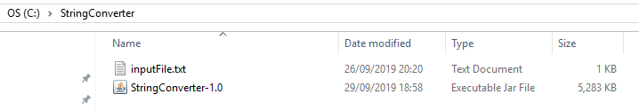
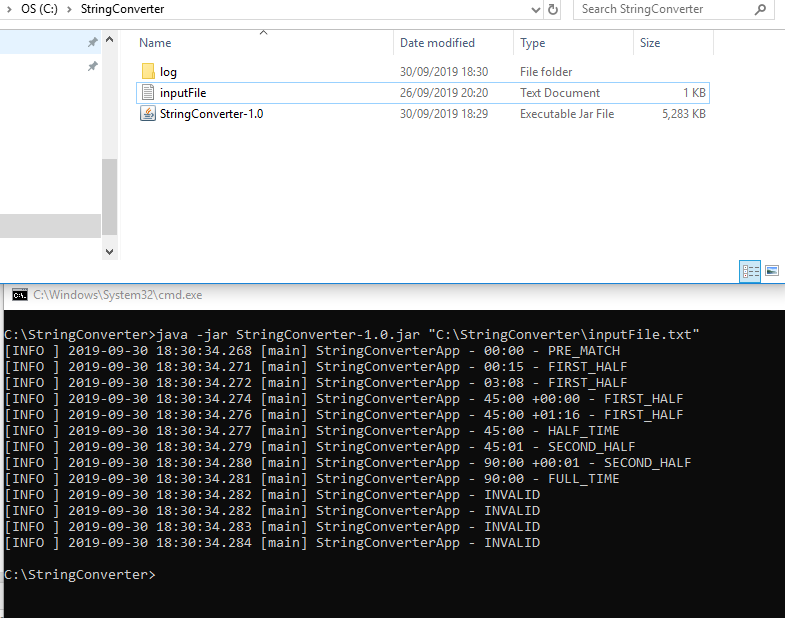
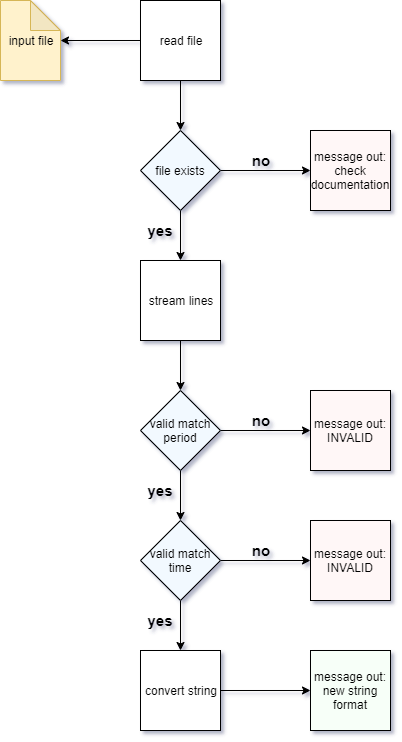
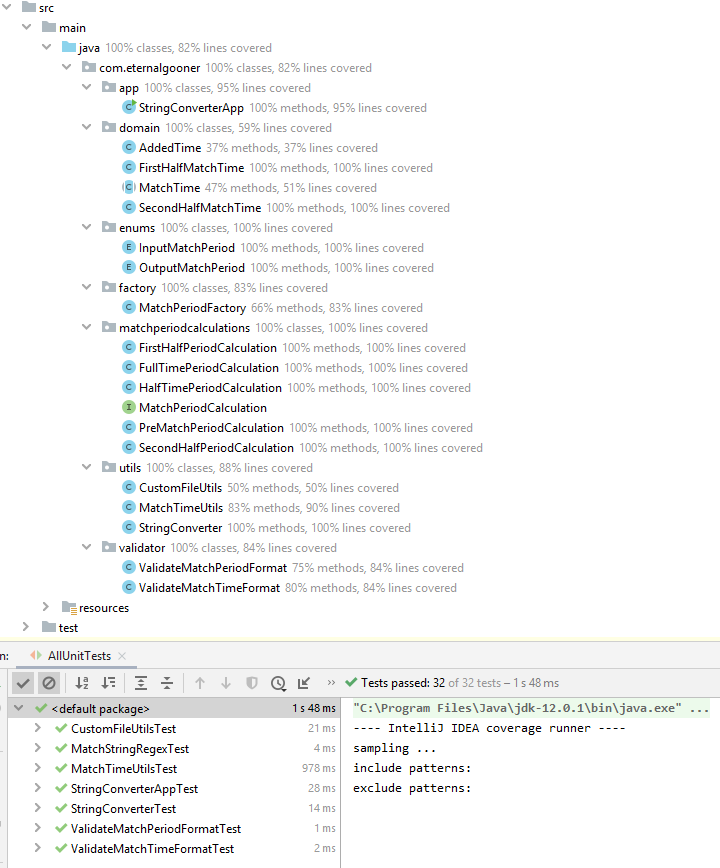

# Introduction
The purpose of this project is to convert a match time and match period from one format to another.\
The below entries are strings and show the conversion from input to expected output.

| Input      | Expected Output |
| ----------- | ----------- |
| [PM] 0:00.000      | 00:00 – PRE_MATCH       |
| [H1] 0:15.025   | 00:15 – FIRST_HALF        |
| [H1] 3:07.513   | 03:08 – FIRST_HALF        |
| [H1] 45:00.001   | 45:00 +00:00 – FIRST_HALF        |
| [H1] 46:15.752   | 45:00 +01:16 – FIRST_HALF        |
| [HT] 45:00.000   | 45:00 – HALF_TIME       |
| [H2] 45:00.500   | 45:01 – SECOND_HALF        |
| [H2] 90:00.908   | 90:00 +00:01 – SECOND_HALF       |
| [FT] 90:00.000   | 90:00 – FULL_TIME       |
| 90:00   | INVALID        |
| [H3] 90:00.000   | INVALID        |
| [PM] -10:00.000   | INVALID        |
| FOO   | INVALID        |

# How to use it?
1. In the GitHub repository you can download the jar file (**StringConverter-1.0.jar**) from the src\target location \
or use this link: https://github.com/eternalgooner/ppb-string-converter/tree/master/target

2. Save the jar file in your desired location, e.g. C:\StringConverter

3. Open a command line window and navigate to the location where the jar file is saved, e.g. `cd C:\StringConverter`

4. Before running the program you need to have an input file containing match data to process. For simplicity you can have this stored in the same directory as the jar file. You can create a file using the test data in the **Test data** section below.

5. Your directory should look like this before the next step:

6. Enter the command `java -jar StringConverter-1.0.jar C:\StringConverter\inputFile.txt`

7. As the command above shows, the program takes 1 argument which is the path to the input file

8. After running the program you will see the output in the console like below. You will also see the newly-generated log folder containing the full event log.

# Logging
There are 2 main forms of logging implemented
- **Console**: When run in the console, all INFO level messages are printed to the screen
- **Log file**: When the program is run, it will generate a log folder in the same directory as the jar file. In this directory will be a log file, logging all DEBUG & INFO messages for a more detailed view of what the application is doing. 

# Design 
## Patterns used
- [x] Factory
- [x] Strategy
## Diagrams
### High level flow

# Testing
## Java version compatibility
The program has been tested running on OpenJDK 12 and Java 8 runtimes.

## OS compatibility
The program has been tested running on:
- Windows 10
- Linux (CentOS)

## Unit testing
- All classes are covered by unit tests
- Sonar Lint is used for code coverage and static analysis
- project structure, showing code coverage and unit tests

## Test data
you can save this test data into a .txt file and use it with the program

[PM] 0:00.000\
[H1] 0:15.025\
[H1] 3:07.513\
[H1] 45:00.001\
[H1] 46:15.752\
[HT] 45:00.000\
[H2] 45:00.500\
[H2] 90:00.908\
[FT] 90:00.000\
90:00\
[H3] 90:00.000\
[PM] -10:00.000\
FOO

# Notes
- The assumption has been made that only normal league matches are allowed (90 mins). i.e. no extra time periods (120 mins)

- 